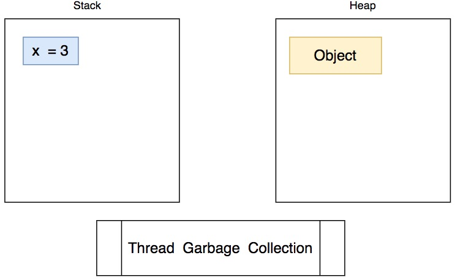

Java WORA: Write Once Run Anywhere

Java có 8 primitives types:

1. byte = 1 byte
2. short = 2
3. int = 4
4. long = 8
5. float
6. double
7. char
8. boolean = 1

Bit đầu tiên là bit dấu (signed bit)

Biến kiểu primitive types không thể null.

Khi nào dùng object và khi nào dùng primitive types?

String là một kiểu đặc biệt (dạng object)

## Thread
Có hai loại vùng nhớ: Stack và Heap.

```java
public static void main(String args[]) {
  int x = 3;
  Object y = new Object();
}



Trong ứng dụng có một thread chuyên về làm nhiệm vụ dọn dẹp gọi là Garbage Collector (dọn rác)
Java quản lý tham chiếu đối tượng kiểu strong reference

## String Pool

Trước đây: Java có một vùng nhớ riêng lưu String, nằm ngoài Heap, dẫn đến Garbage Collector không dọn rác được những biến String đã dùng.

Sau đó: Java chuyển vùng nhớ String Pool vào vùng nhớ Heap.

`==` : toán tử so sánh địa chỉ
`equals`: so sánh nội dung chuỗi

```java
String a = "Hello";
String b = "Hello";
String c = new String("Hello");
if (a == b) { //Sẽ trả về true do cả a và b cùng nằm trong String pool và cùng lưu ở một địa chỉ

}

if (c == a) { //Sẽ trả về false vì c nằm ở trong heap

}
```

Chú ý: String trong Java là immutable

```java
package demo;

class Main{
  public static void main (String[] args) {
    System.out.println("Java Core");
    String a = "Hello";
    String b = "Hello";
    String c = new String("Hello");
    if (a == b) {
      System.out.println("a==b");
    }
    if (a != c) {
      System.out.println("a!=b");
    }
  }
}
```

## Thread vs MultiThreads

Câu hỏi: ứng dụng chạy Single Thread và ứng dụng chạy Multi Threads, cái nào nhanh hơn?
Trả lời: Còn tuỳ thuộc vào số lượng tác vụ, nội dung tác vụ phải thực hiện

Hệ điều hành có Scheduler để lập lịch cho tác vụ cùng chạy chia sẻ trên cùng một CPU core.


Có 2 loại task:
1. I/O Bounded Task: đọc ghi vào ổ cứng, kết nối HTTP, truyền dữ liệu.
2. CPU Bounded Task: các tác vụ tính toán

Concurrent là chạy nhiều task sử dụng một single processor, các task chia sẻ CPU time nhờ tiến trình lập lịch.

Parallel chỉ xuất hiện khi CPU có multi-processor

Thường sử dụng multi-thread cho I/O Bounded Tasks. Tuy nhiên không phải cứ nhiều thread là tối ưu tốc độ. Bởi vì context switch sẽ tốn CPU cycle.

`Context Switch` là các bước để lưu trạng thái hiện thời của một tác vụ X, để chuyển sang tác vụ Y, sau khi tác vụ Y xong, thì khôi phục lại trạng thái tác vụ X để tiếp tục thực hiện.

`Context Switch` tốn kém CPU cycle


## Thread Pool
Vùng nhớ lưu sẵn các đối tượng thread tạo sẵn để chờ thực hiện tác vụ mới

## Data Race
Ví dụ 2 thread cùng t
Cách xử lý:
1. Lock
2. Synchronization
3. Atomic

HashMap ---> ConcurrentHashMap

ConcurrentHashMap sử dụng Lock suy giảm tốc độ.