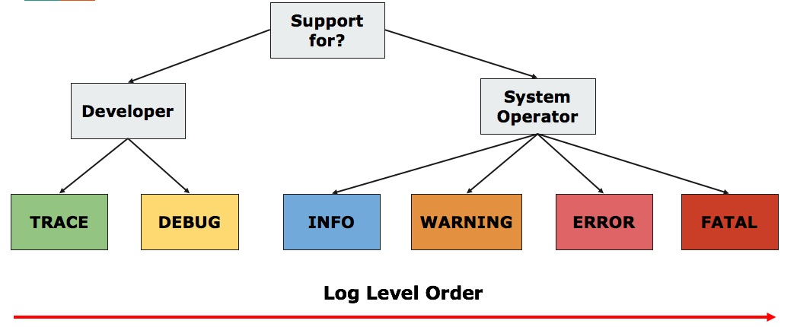
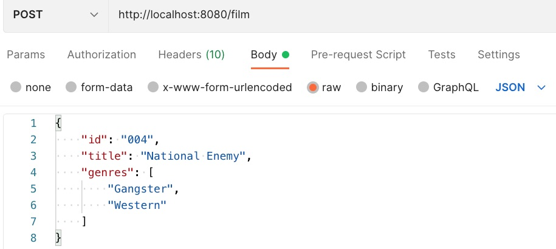

# Logging trong ứng dụng Spring Boot

Các nội dung chính trong bài này
1. Mục đích của logging
2. Hai cách tạo đối tượng logger
3. Cấp độ logging
4. Cấu hình lọc cấp độ logging trong application.properties
5. Sử dụng annotation `@Slf4j` của Lombok
6. CommonsRequestLoggingFilter
7. CustomURLFilter
8. RequestBodyAdviceAdapter

## 1. Mục đích của Logging trong web frameworks là gì?
Logging dùng để debug lỗi trong lúc lập trình, hoặc lưu lại lỗi trong lúc ứng dụng vận hành. Với Web framework, logging còn để lưu lịch sử request và response.
Đầu ra của logging sẽ có một số loại:
- Console: phổ biến nhất, dễ nhất, mặc định có
- File: ghi ra file, cần cấu hình thư mục
- Database: ghi vào CSDL
- REST: gọi vào REST
- Hoặc tự viết custom logging output

Mặt trái của logging là làm cho hiệu suất phục vụ của web framework giảm

## Cấu trúc thư mục dự án demo
```
.
├── advice
│   ├── CustomExceptionHandler.java -> Bắt tất cả Exception quăng ra
│   └── CustomRequestBodyAdviceAdapter.java  -> Lọc và xem body của request gửi đến
├── config
│   └── AppConfig.java -> Cấu hình bean CommonsRequestLoggingFilter và FilterRegistrationBean<CustomURLFilter>
├── controller
│   ├── FilmController.java -> REST controller Thêm film và tìm film theo id
│   └── LogController.java -> Thử nghiệm 2 cách tạo logger dùng Logger Factory và dùng @Slf4j
├── dto
│   └── FilmRequest.java  -> DTO lưu thông tin Film
├── exception
│   ├── APIError.java -> Class lưu thông tin lỗi trả về cho REST client
│   └── FilmException.java -> Custom RuntimeException riêng cho dự án Film
├── filter
│   └── CustomURLFilter.java -> Dùng để lọc request đến có URL bắt đầu bằng `/film`
├── model
│   └── Film.java <- Entity Film
├── repository
│   ├── FilmRepo.java <- Interface repository
│   └── FilmRepoImpl.java <- Implementation của repository
├── service
│   ├── FilmService.java <- Interface service
│   └── FilmServiceImpl.java <- Implementation của service
└── DefaultlogApplication.java
```
## 2. Hai cách tạo đối tượng logger

Để xuất sự kiện, thông tin ra log, chúng ta cần tạo đối tượng logger. Có 2 cách để tạo đối tượng logger. Xem [LogController.java](src/main/java/vn/techmaster/defaultlog/controller/LogController.java)

**Cách 1: Sử dụng `LoggerFactory.getLogger`**
Cách này bạn cần phải truyền kiểu class sẽ sở hữu đối tượng logger
```java
Logger logger = LoggerFactory.getLogger(LogController.class); //Cần truyền đúng kiểu class, truyền sai logger vẫn chạy nhưng thông tin log sẽ không chính xác
```

**Cách 2: Sử dụng Lombok annotation `@Slf4j`**
Lombok sẽ bổ xung đối tượng Logger sau khi ứng dụng biên dịch bằng kỹ thuật Bytecode Manipulation.

```java
@RestController
@Slf4j
public class LogController {
  @GetMapping("/slf4j")
  public String slf4jLog() {
    log.trace("A TRACE Message");
    log.debug("A DEBUG Message");
    log.info("An INFO Message");
    log.warn("A WARN Message");
    log.error("An ERROR Message");
    return "Sử dụng slf4j";
  }
}
```
## 3. Log Exception
Khi có một exception quăng ra, lập trình viên cần làm 4 việc chính:

1. **Catch:** Bắt lấy exception đó. Bạn có thể bắt ngay trong hàm nhưng như vậy logic code sẽ bị trộn lẫn với exception handling code. Chúng ta chỉ làm vậy khi cần tiến hành hoạt động khắc phục hoặc chạy phương án B. Còn tốt nhất hay bắt Exception ở một class chuyên dụng, để code xử lý exception tách khỏi code nghiệp vụ. Đã có một bài báo rất hay [5 Reasons Why Business Exceptions Are a Bad Idea](https://reflectoring.io/business-exceptions/) giải thích tại sao tạo custom business exception là một ý tưởng tồi. Ý kiến của tác giả cho rằng chúng ta cần code xử lý tất cả các khả năng (case) của luồng nghiệp vụ, còn exception chỉ dành mô tả ngoại lệ, lỗi, chứ không lạm dụng nó để mô tả một business case. Khi tách bạch như vậy, chúng ta có thể tách phần xử lý exception ra khỏi nghiệp vụ như vậy code sẽ clean hơn.

2. **Recovery:** Khôi phục - khắc phục. Mở một file để đọc, đang đọc dở thì dữ liệu bad -> bắt Exception rồi đóng file lại. Thực hiện một transaction, đột nhiên phát sinh lỗi, cần rollback lại, gửi email thông báo..

3. **Reporting** Báo lỗi cho client. Để code clean, gọn chúng ta cũng nên thực hiện việc báo lỗi ở một class chuyên biệt. `Xem [CustomExceptionHandler.java](src/main/java/vn/techmaster/defaultlog/advice/CustomExceptionHandler.java).
Việc báo lỗi cung cấp thông tin lỗi ngay cho client: ở đây có thể là end-user (khách hàng cuối cùng) hoặc dev. Với end-user, cần chú ý đến trải nghiệm UX giao diện báo lỗi.

4. **Logging** Log lỗi. Nếu lỗi xảy ra bất chợt, vào ban đêm, không theo quy luật nào. Việc log lại và làm sao giúp dev dễ dàng tìm lỗi, nguyên nhân dễ dàng trong danh sách log rất quan trọng. Nếu ứng dụng ghi ra 1 triệu dòng log chung chung, không giúp ích cho dev tìm ra lỗi thì thà không log lỗi còn tốt hơn: tiết kiệm CPU time, RAM và ổ cứng lưu log. Do đó việc chia nhỏ log theo nguồn gốc, phân loại cấp độ log, theo thời điểm giúp ích rất nhiều cho dev.

Đoạn code dưới thuộc file [CustomExceptionHandler.java](src/main/java/vn/techmaster/defaultlog/advice/CustomExceptionHandler.java) thực hiện 2 việc: Reporting và Logging. Nó tách biệt ra khỏi busines logic code.

```java
@Order(Ordered.HIGHEST_PRECEDENCE)
@RestControllerAdvice
@Slf4j  //annotation để Lombok can thiệp tạo đối tượng logger
public class CustomExceptionHandler extends ResponseEntityExceptionHandler {
  
  @ExceptionHandler(value = {Exception.class, RuntimeException.class})
  public final ResponseEntity<APIError> handleAllExceptions(Exception ex, WebRequest request) {
    APIError apiError = new APIError("Generic Exception", ex.getLocalizedMessage());
    log.error(ex.getLocalizedMessage());  //Khi có lỗi thì log
    return new ResponseEntity<>(apiError, HttpStatus.INTERNAL_SERVER_ERROR);
  }
}
```

## 4. Cấp độ logging


## 5. Cấu hình lọc cấp độ logging trong application.properties
SpringBoot cho phép tuỳ biến cấp độ logging sẽ xuất ra console, xem file [application.properties](src/main/resources/application.properties). Màn hình console nếu có quá nhiều thông tin xuất ra một lúc sẽ khiến lập trình viên bối rối. Do đó bạn có thể nâng cấp độ logging để ẩn bớt những logging cấp độ thấp hơn.

```
logging.level.root=ERROR
logging.level.vn.techmaster.defaultlog.service=TRACE
logging.level.org.springframework.web.filter.CommonsRequestLoggingFilter=TRACE
logging.level.vn.techmaster.defaultlog.filter.CustomURLFilter=INFO
logging.level.vn.techmaster.defaultlog.advice=INFO
```

- `logging.level.root=ERROR`: cấu hình cho toàn bộ ứng dụng, chỉ in ra log từ cấp độ ERROR
- `logging.level.vn.techmaster.defaultlog.service=TRACE`: cấu hình riêng cho package `vn.techmaster.defaultlog.service` xuất ra console từ cấp độ TRACE
- `logging.level.org.springframework.web.filter.CommonsRequestLoggingFilter=TRACE`: cấu hình riêng cho CommonsRequestLoggingFilter từ cấp độ TRACE

Hãy chạy chương trình rồi vào [http://localhost:8080/log/basic](http://localhost:8080/log/basic) và [http://localhost:8080/log/slf4j](http://localhost:8080/log/slf4j)

Do cấp độ lọc logg toàn cục từ mức ERROR `logging.level.root=ERROR` nên sẽ chỉ có log ERROR được xuất ra console
```
ERROR 3661 --- [nio-8080-exec-1] v.t.defaultlog.controller.LogController  : An ERROR Message
```


## 6. Log tất cả các request đến bằng CommonsRequestLoggingFilter

Tình huống như sau: web site bị hackaer tấn công bằng cách gửi request có định dạng đặc biệt khiến server xử lý lỗi. Nhiệm vụ của dev là log tất cả các request đến. `CommonsRequestLoggingFilter` là một bean kiểu Filter giám sát các request gửi đến.
```java
import org.springframework.context.annotation.Bean;
import org.springframework.context.annotation.Configuration;
import org.springframework.web.filter.CommonsRequestLoggingFilter;

@Configuration
public class AppConfig {
  @Bean
  public CommonsRequestLoggingFilter logFilter() {
    CommonsRequestLoggingFilter filter = new CommonsRequestLoggingFilter();
    filter.setIncludeQueryString(true);
    filter.setIncludePayload(true);
    filter.setMaxPayloadLength(10000);
    filter.setIncludeHeaders(false); //Bỏ không in request header
    filter.setAfterMessagePrefix("REQUEST DATA : ");
    return filter;
  }
```
Để `CommonsRequestLoggingFilter` xuất được log ra console cần cấu hình cấp độ là `TRACE` hoặc `DEBUG` trong application.properties
```
logging.level.org.springframework.web.filter.CommonsRequestLoggingFilter=TRACE
```

### 6. Chỉ log request có đường dẫn đặc thù CustomURLFilter

Nếu ứng dụng web có rất nhiều route khác nhau, việc lọc tất cả request khiến màn hình console đầy ặc những thông tin không cần thiết. Lúc này cần tạo CustomURLFilter. Ví dụ tôi chỉ muốn log các request có URL bắt đầu bằng `/film`

Bước 1: Tạo [CustomURLFilter.java](src/main/java/vn/techmaster/defaultlog/filter/CustomURLFilter.java)


```java
import javax.servlet.*;
import javax.servlet.http.*;
import lombok.extern.slf4j.Slf4j;

@Slf4j
public class CustomURLFilter implements Filter {

  @Override
  public void doFilter(ServletRequest servletRequest, ServletResponse servletResponse, FilterChain filterChain)
      throws IOException, ServletException {
    HttpServletRequest request = (HttpServletRequest) servletRequest;
    HttpServletResponse response = (HttpServletResponse) servletResponse;

    log.info("Logging Request  {} : {}", request.getMethod() , request.getRequestURI());

    // call next filter in the filter chain
    filterChain.doFilter(request, response);
    log.info("Logging Response :{}", response.getContentType());
  }
}
```

Bước 2: đăng ký `customURLFilter` bằng `FilterRegistrationBean`
Xem [AppConfig.java](src/main/java/vn/techmaster/defaultlog/config/AppConfig.java)

```java
@Configuration
public class AppConfig {
  @Bean
  public FilterRegistrationBean<CustomURLFilter> filterRegistrationBean() {
    FilterRegistrationBean<CustomURLFilter> registrationBean = new FilterRegistrationBean<>();
    CustomURLFilter customURLFilter = new CustomURLFilter();

    registrationBean.setFilter(customURLFilter);
    registrationBean.addUrlPatterns("/film/*");
    registrationBean.setOrder(2); // set precedence
    return registrationBean;
  }
}
```

Khi truy cập vào đường dẫn http://localhost:8080/film/001, màn hình console sẽ in ra. Chú ý `v.t.defaultlog.filter.CustomURLFilter`
```
2021-12-06 15:35:48.851  INFO 2203 --- [nio-8080-exec-1] v.t.defaultlog.filter.CustomURLFilter    : Logging Request  GET : /film/001
2021-12-06 15:35:48.882 TRACE 2203 --- [nio-8080-exec-1] v.t.defaultlog.service.FilmServiceImpl   : getFilmById(001)
2021-12-06 15:35:48.941  INFO 2203 --- [nio-8080-exec-1] v.t.defaultlog.filter.CustomURLFilter    : Logging Response :application/json
```

Dòng `v.t.defaultlog.service.FilmServiceImpl   : getFilmById(001)` do đoạn code này ở file [FilmServiceImpl.java](src/main/java/vn/techmaster/defaultlog/service/FilmServiceImpl.java)
```java
@Service
@Slf4j
public class FilmServiceImpl implements FilmService {

  @Override
  public Film getFilmById(String id) {
    log.trace("getFilmById(" + id + ")");  //Đoạn này xuất ra log
    return filmRepo.getFilmById(id)
    .orElseThrow(() -> {
      return new FilmException("Film not found", id);
    });
  }

```
## 7. Sử dụng `RequestBodyAdviceAdapter` để xoi body request

Trường hợp chúng ta cần phải giám sát body request gửi lên hãy dùng `RequestBodyAdviceAdapter`
Xem file [CustomRequestBodyAdviceAdapter.java](src/main/java/vn/techmaster/defaultlog/advice/CustomRequestBodyAdviceAdapter.java)

Khi tạo một post request tới địa chỉ http://localhost:8080/film



Kết quả log như sau
```
INFO 3548 --- [nio-8080-exec-1] v.t.d.a.CustomRequestBodyAdviceAdapter   : FilmRequest[id=004, title=National Enemy, genres=[Western, Gangster]]
```


## Kết luận

Spring Boot cung cấp rất nhiều kỹ thuật khác nhau để logging và logging cho những mục đích khác nhau

1. Log exception, log để debug.
2. Có nhiều cấp độ log khác nhau: Trace, Debug, Info,  Warn, Error, Fatal
3. Có thể cấu hình chọn lọc lỗi theo cấp độ và theo package
4. Có thể log request bằng CommonsRequestLoggingFilter
5. Dùng CustomURLFilter để lọc request theo URL
6. Có thể giám sát, xoi body request gửi lên sử dụng class kế thừa `RequestBodyAdviceAdapter`. Có thể chỉnh sửa thay đổi body của request ở phương thức `afterBodyRead`

Nếu bạn bị ngộp bởi quá nhiều kỹ thuật log khác nhau của Spring Boot, thì cách đơn giản nhất bạn cần làm.
1. Dùng Lombok trong dự án
2. Đánh dấu các class cần tạo đối tượng log bằng `@Slf4j`
3. Cấu hình lọc logging qua level và package ở file application.properties
4. Nên tách phần xử lý exception, logging ra khỏi business logic code càng nhiều càng tốt
