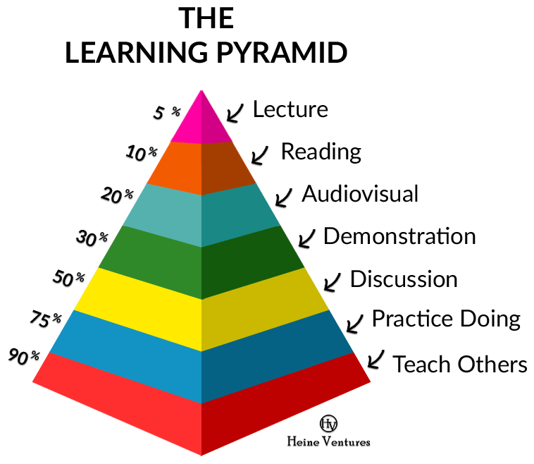

# Mục tiêu khoá học

Đào tạo lập trình viên Java Backend, tập trung xây dựng REST API, thiết kế CSDL quan hệ, phi quan hệ tiến tới tham gia dự án Microservice.

Tổng số buổi học 28
Số buổi học DevOps - Docker 6
Số buổi học React.js 4-5 nếu chúng ta hoàn thành sớm Java Spring Boot

## Yêu cầu đối với sinh viên
1. Sau 12 buổi bắt đầu tham gia dự án Spring Boot ở OneMount.
2. Học chủ động thay vì thụ động nhận mã nguồn mẫu từ giảng viên
3. Thí nghiệm, quan sát, hỏi đáp, rút kinh nghiệm, chia sẻ, cải tiến
4. Lập trình cụ thể báo cáo rõ ràng

## KHÔNG NÊN
1. Cưỡi ngựa xem hoa
2. Nước đến chân mới nhạy
3. Chỉ tay năm ngón
4. Chưa học bò đã đòi học chạy
5. Coi thầy

## Kinh nghiệm khi lập trình Java, Spring Boot

1. Java có cú pháp OOP và các thư viện rất phức tạp. Spring Boot có cực kỳ nhiều annotation. Việc ghi nhớ hết cú pháp, annotation thực sự tốn kém năng lượng não bộ. Tốt nhất là không nên nhớ. Thay vì đó code nhiều để tích luỹ các mã nguồn, hiểu rõ, rồi chú thích lại kỹ càng để sau đọc lại có thể hiểu được luôn.
2. REST lập trình tương đối dễ và giống nhau ở mọi web frameworks. Phần khó không phải học Spring Boot, REST hay Java. Phần khó là phân tích nghiệp vụ (business analysis), thiết kế hệ thống (system design), xử lý vấn đề (problem solving), kiến trúc (software architect)
3. Khi nào bạn rối trí, hoang mang hãy quay về căn bản để ôn tập lại. Back to basic.
4. Chia việc lớn thành nhiều việc nhỏ, dễ đã quen.

