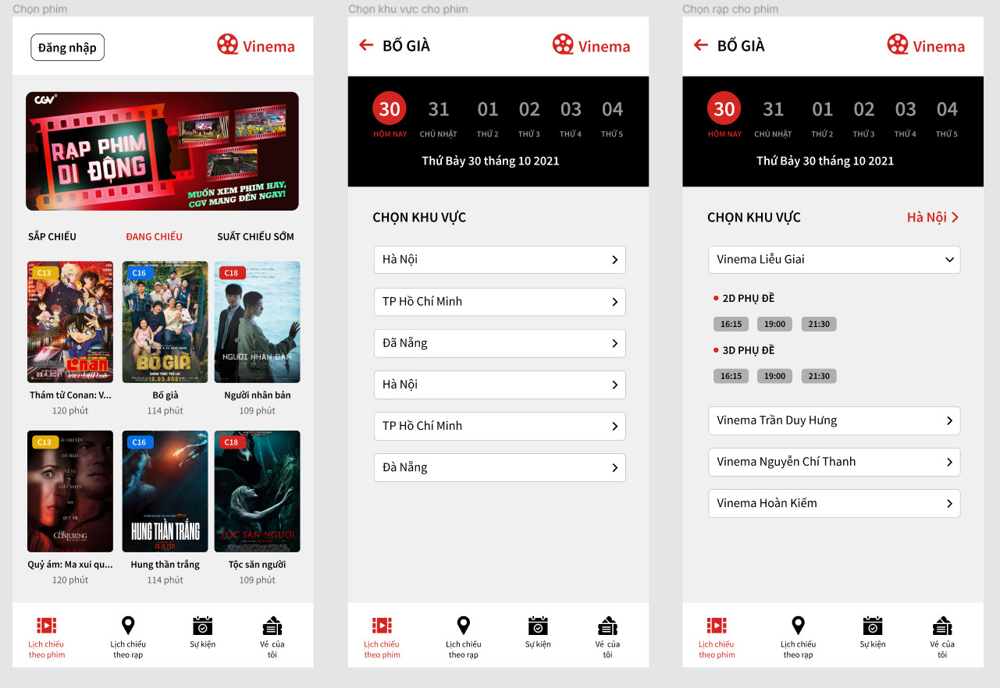
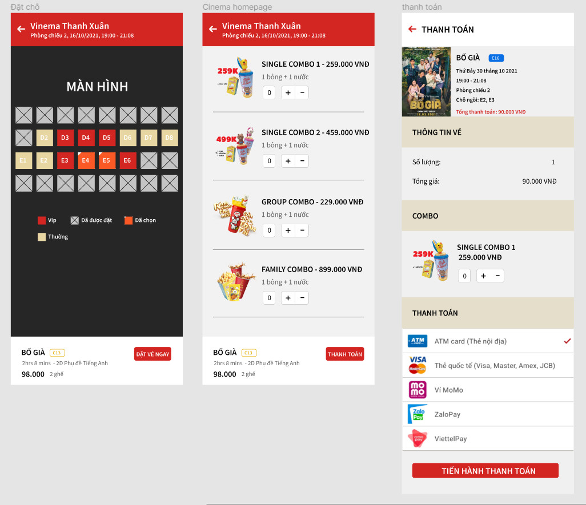

# Chương trình đào tạo Spring Boot phiên bản nâng cấp

## Quy trình đào tạo
- Một tuần học 2 buổi. Mỗi buổi 2.5 tiếng online hoặc 3 tiếng với thực hành tại chỗ.
- Kết hợp dạy xen kẽ 14 buổi offline và 14 buổi online có ghi hình bài giảng.
- Giảng viên chính: Trịnh Minh Cường - Nguyễn Văn Thưởng (Docker)
- Trợ giảng chấm bài, hỗ trợ: Lục Thanh Ngọc - Đặng Quang Minh.
- Thiết kế giao diện ứng dụng đặt vé trực tuyến: Nguyễn Cao Hưng.
- Hỗ trợ kỹ thuật lập trình client side React: Đặng Quang Huy - Nguyễn Xuân Ba *(không dạy chỉ trả lời hỏi đáp qua email, zalo)*.
- Trợ giảng, chấm bài từng buổi. Giảng viên chính hướng dẫn làm đồ án.

**Giao diện dự án đặt vé xem phim qua mạng**
Giảng viên code 30%, sinh viên hoàn thành nốt 70% còn lại

## Thay đổi
1. Bổ xung kỹ thuật phân tích thiết kế hệ thống back end.
2. Chuyên sâu lập trình REST API cho Client Side Rendering.
3. Thêm phần Java Micro Benchmark để đánh giá tối ưu tốc độ thực thi.
4. Bổ xung lập trình Socket Server sử dụng [EzyFoxServer](https://github.com/youngmonkeys/ezyfox-server) thay thế cho cho thư viện Socket chậm và khó lập trình của Spring Boot
5. Bổ xung dự án mẫu API Gateway sử dụng Traefik để sinh viên so sánh với Spring Cloud Gateway
6. Rút ngắn 1 buổi dạy JPA (giữ nguyên nội dung), để thêm 1 buổi dạy kết nối Redis server
7. Rút 6 buổi dạy Docker xuống 4 buổi nhưng sẽ bổ xung nội dung Docker Swarm

Như vậy nội dung đào tạo tăng nhưng số buổi giữ nguyên. Do đó sinh viên sẽ phải chủ động nhiều hơn. Đặc biệt nếu sinh viên đã học lớp này thì nên làm dự án Spring Boot luôn, không nên tham gia dự án lập trình giao diện hay các công nghệ khác.

## Kế hoạch giảng dạy
> Chú ý: thứ tự buổi học có thể hoán đổi để phù hợp với khả năng tiếp thu của sinh viên. Những buổi học Docker dạy vào chiều thứ 7 hàng tuần.

### 01. Cài đặt môi trường lập trình Spring Boot
1. Mục tiêu khoá học, phương pháp học
2. Giới thiệu yêu cầu, ý tưởng đồ án tốt nghiệp: web site bán hàng, web site đặt vé trực tuyến
3. Tạo một dự án REST API Spring Boot Maven
4. Kỹ thuật debug căn bản trên VSCode
5. Tóm tắt lại cú pháp căn bản của Java thường xuyên dùng trong Spring Boot
   1. OOP: class, interface
   2. generics
   3. annotation

**Bài tập**
- Mô phỏng hướng đối tượng quan hệ: Lớp - Sinh viên - Sinh viên theo học lớp

### 02. Cấu trúc dữ liệu phổ biến trong Java

1. List - Map - Set - Queue (xếp theo tần suất sử dụng, các ví dụ căn bản)
2. Phân tích thống kê tập dữ liệu 1000 người các thành phố khác nhau, nghề nghiệp, giới tính, độ tuổi khác nhau. Giảng viên chỉ ví dụ 50% các hàm.

**Bài tập**
- Sinh viên lập trình nốt 50% còn lại.

### 03. Java Stream API và Lambda Expression
1. Tại sao Java Stream và Lambda Expression giúp code clean hơn?
2. Tóm tắt các nhóm hàm chính trong Java Stream API:
   - `Stream.of` tạo stream
   - Chuyển đổi sang cấu trúc dữ liệu khác
   - `.iterate`: duyệt
   - `.collect`: chọn
   - `.map`: ánh xạ
   - `.filter`: lọc, tìm kiếm
   - `.limit`: giới hạn
   - `.groupingBy`: nhóm
   - `.skip`: bỏ qua
   - `.distict`: loại phần tử lặp lại
   - `.sorted`: các phương pháp sort chuẩn, sort theo trường, hàm sort tự viết
   - `.findAny` vs `.findFirst`: tìm

**Bài tập**
- Thực hiện lại bài tập lập trình buổi trước bằng Java Stream API

### 04. Viết kiểm thử tự động JUnit5, AssertJ
1. Các annotation, hàm JUnit5 `@BeforeAll, @BeforeEach, @AfterAll, @AfterEach`
2. AssertJ, FluentAPI
3. Ví dụ viết unit test so sánh kết quả lập trình Java Stream API

**Bài tập**
- Bổ unit test kiểm tra stream API

### 05. Dependency Injection
- Lập trình theo interface
- Các Spring Boot quản lý Bean, Component
- Ba cơ chế DI phổ biến
- Giải thích - ví dụ sử dụng annotation

**Bài tập**
- Mô phỏng component gửi email nhưng có nhiều biến thể (implementation) khác nhau

### 06. Khác biệt giữa ứng dụng Client Side vs Server Side
- Ý nghĩa `@Controller`, `@Service`, `@Repository`
- Demo sự khác biệt một ứng dụng CRUD sử dụng Thymeleaf vs sử dụng React

**Bài tập**
- Hoàn thiện nốt chức năng Xoá, Tìm kiếm của ứng dụng React --> Spring Boot

### 07. Thực hành thư viện Lombook
- Chữa bài tập buổi 2-3-4-5
- Các hiểu ý nghĩa annotation của Lombook qua các ví dụ
- `@AllArgsConstructor`, `@NoArgsConstructor`, `@RequiredArgsConstructor`, `@Data`
- `@Getter`, `@Setter`
- `@Cleanup`, `@Value`, `@With`
- `@Log`

### 08. Thiết kế REST API
> Để học buổi này sinh viên đã phải biết lập trình Spring Boot căn bản

1. Tóm tắt phương thức GET, POST, PUT, DELETE
2. Request vs Response. Header vs Body
3. URL parameters vs body parameters
4. Document REST API sử dụng swagger
5. Quản lý version REST API

**Bài tập**
- Thiết kế API để chọn đội bóng
- Thiết kế API quản lý mặt hàng web site bán trực tuyến

### 09. Báo lỗi REST API -  Logging sử dụng Log4J2
1. Ý nghĩa HTTP Status code
2. Try catch exception. Phân biện checked vs unchecked exceptiont trong Java
3. Định nghĩa Custom Exception
4. Trả về thông điệp có ý nghĩa
5. Báo lỗi trong lúc development khác gì với báo lỗi ở production
6. Logging `SFLog2J`

### 10. Tối ưu và đánh giá tốc độ
> Buổi này dùng để xử lý các thắc mắc của sinh viên, review bài tập và dạy thêm kỹ thuật benchmark tốc độ

1. Tại sao cần đo đạc, tốc độ, hiệu năng hàm trong Java?
2. Phân tích trọng số, loại bỏ yếu tố ngoại lai. Tối ưu quá sớm cùng không tốt - Premature optimization is evil
3. Sử dụng Java Microbenchmark Harness để đo tốc độ thực thi.
4. Ví dụ:
   - So sánh tốc độ các phương pháp liệt kế số nguyên tố
   - So sánh tốc độ khi không dùng và dùng Stream API

### 11. Phân tích thiết kế đồ án tốt nghiệp
1. Những câu hỏi nên đặt ra khi khảo sát yêu cầu khách hàng - người dùng
2. Phân tích - phát triển yêu cầu: đối chiếu, xác nhận với khách hàng làm sao hiệu quả.
3. Sử dụng Draw.io vẽ User story - diagram để khách hàng hiểu được ngay họ muốn gì.
4. Thiết kế bảng dữ liệu quan hệ ERD ví dụ với CSDL Postgresql và công cụ DBeaver.
5. Các quan hệ bảng căn bản: 1:1, 1:M, M:M, recursive, inheritance

**Bài tập**
- Phân tích thiết kế web site đặt vé xem phim trực tuyến

### 12. Thiết kế CSDL
1. Các ví dụ phổ biến: `{user, role}, {product, service, price, promotion}, {order, order_item, order_event}, {employe-manager}`
1. Các lỗi căn bản khi thiết kế bảng CSDL: không lưu lịch sử, quá khó truy vấn
2. Sự kiện (event) khác gì với trạng thái (status). Quản lý sự kiện (event) - trạng thái (status) theo thời gian

**Bài tập**
- Viết lệnh DDL tạo bảng, quan hệ, và câu lệnh truy vấn thử nghiệm
- Tiếp tục hoàn thiện phân tích thiết kế web site đặt vé xem phim trực tuyến

## 13. JPA - Java Persistence API
1. Định nghĩa Entity
2. Primary key: sử dụng ID tự tăng hay chuỗi sinh ngẫu nhiên?
3. Quan hệ 1:1, 1:M, M:M, M:M có cột trung gian
4. Render JSON
5. Các interface `JpaRepository, CRUDRepostory`
6. [Giải thích 1-20 annotation căn bản của JPA](https://dzone.com/articles/all-jpa-annotations-mapping-annotations)
**Bài tập**
- Mô hình qua toàn bộ web site đặt vé xem phim trực tuyến bằng JPA

## 14. Created, Update, Delete
1. Thêm bản ghi và bản ghi liên quan
2. Quản lý transaction trong JPA: Nested Transaction
3. [Giải thích 21-40 annotation nâng cao của JPA](https://dzone.com/articles/all-jpa-annotations-mapping-annotations)

## 15. JPA - Query - Custom repository
1. Derived query
2. Custom query
3. Custom Repository
4. [Giải thích 41-80 annotation nâng cao của JPA](https://dzone.com/articles/all-jpa-annotations-mapping-annotations)

**Bài tập**
- Hoàn thiện repo quản lý phim, rạp chiếu, lịch chiếu, suất chiếu, giữ chỗ, mua vé

## 16. Schedule - Background josb
1. Fixed Rate
2. Fixed Delay
3. Cron Job

**Bài tập**
- Quét để huỷ lệnh giữ chỗ quá hạn thanh toán

## 17. Kết nối Redis
1. Công cụ quản lý Redis
2. Các lệnh Rediscli căn bản
3. publish - subscribe
4. Redis stream

## 18. Lập trình Web Socket sử dụng EzyFox Server
1. Mô hình Request - Response khác gì với Publish - Subscribe
2. Keep Connection Alive
3. Ping - Pong
4. Notify user vs Notify group
5. Broad Cast All

**Bài tập**
- Lập trình kết nối từ Spring Boot tới EzyFox Server qua Redis stream

## 19. Ghép nối với ứng dụng giao diện React / jQuery
> Sinh viên sẽ phải tự học React hoặc jQuery ở nhà. Giao diện tĩnh HTML cho sẵn.

1. Thiết kế màn hình liệt kê phim, danh sách rạp, lịch chiếu, tìm kiếm phim theo tiêu đề
2. Màn hình giữ chỗ trực quan đến từng vị trí ghế ngồi
3. Hiển thị trạng thái giữ chỗ theo thời gian thực
4. Axios vs RTK Query

**Bài tập**
- Sinh viên lập trình JavaScript trên mã nguồn web site tĩnh có sẵn HTML, CSS.

## 20-21. Thực hành liệt kê danh sách rạp, phim, chi tiết phim, tìm kiếm phim theo tiêu đề
- Màn hình chính
- Màn hình liệt kê rạp, phân nhóm theo tỉnh - thành phố
- Màn hình liệt kê phim theo rạp
- Màn hình tìm kiếm
  

## 22-23. Hiển thị trạng thái giữ chỗ theo thời gian thực sử dụng Ezyfox Server
- Lập trình cập nhật trạng thái từng chỗ theo thời gian thực
- Đặt vé
- Xử lý thanh toán

## 24-28. Thực hành Docker - Docker Swarm
- Docker căn bản: `docker pull, docker run, docker ps, docker image ls, docker inspect, docker exec, docker log`
- Docker Compose
- Đóng gói ứng dụng Spring Boot vào Docker image
- Khởi động VM bằng Vagrant
- Docker Swarm
- Ví dụ API Gateway: Spring Cloud vs Traefik